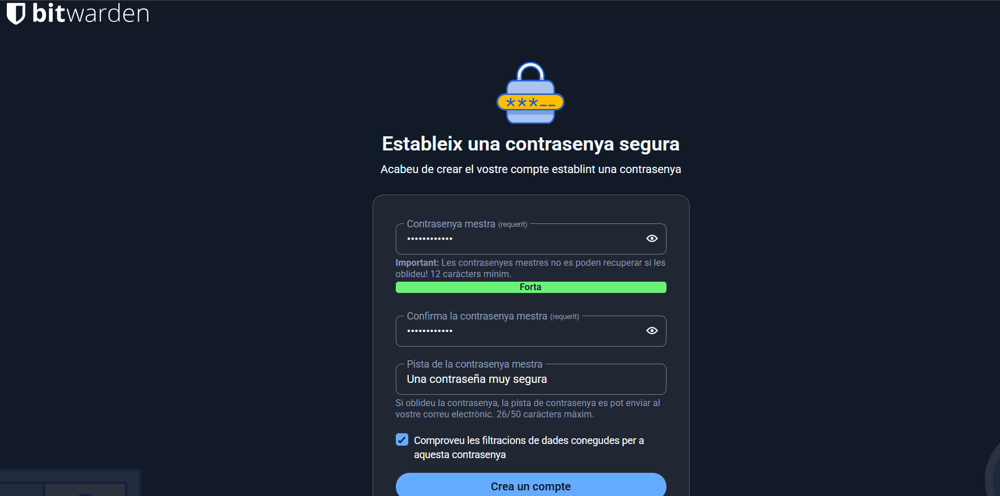
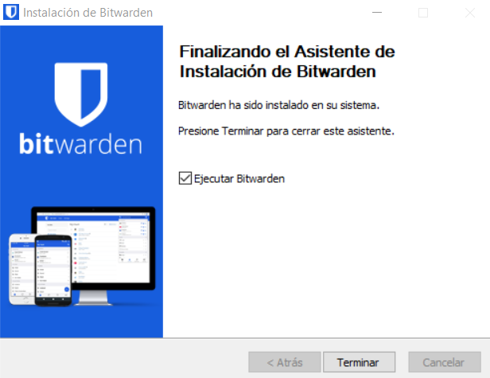
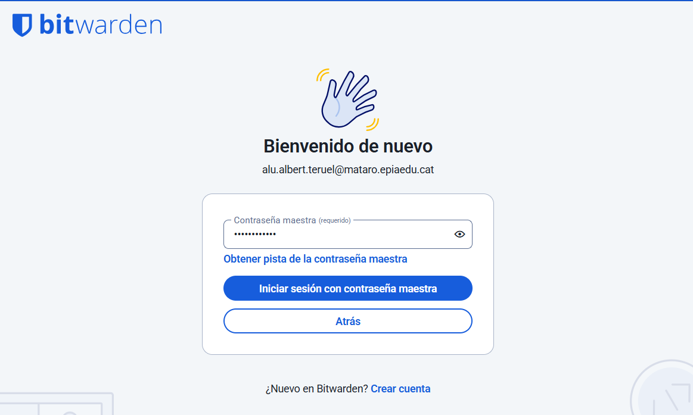
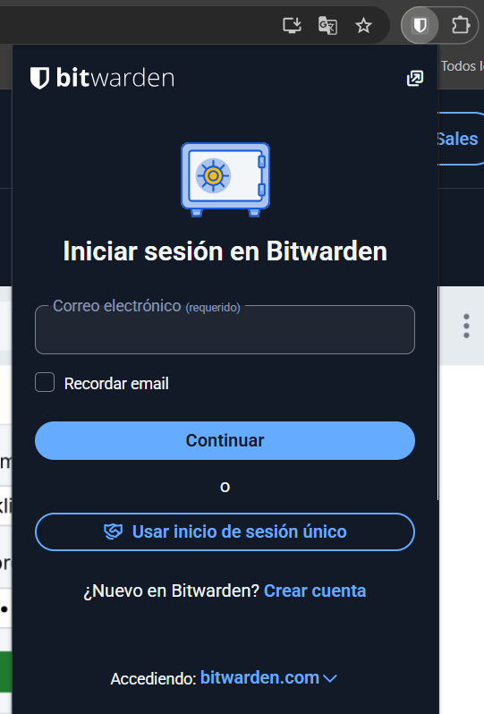
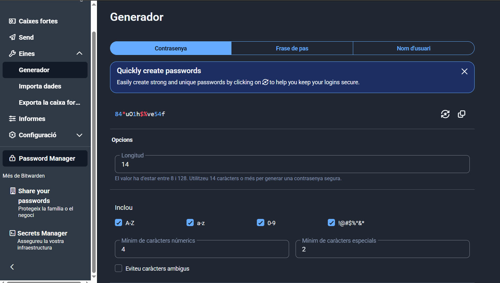
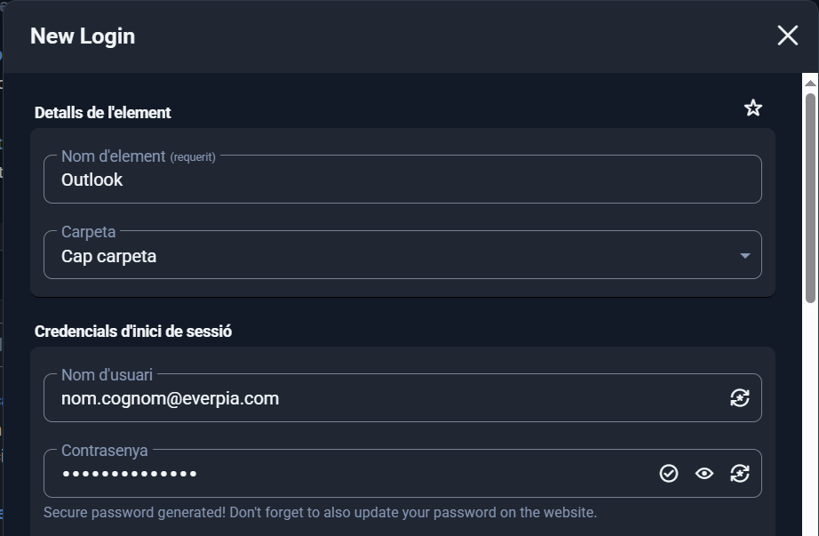
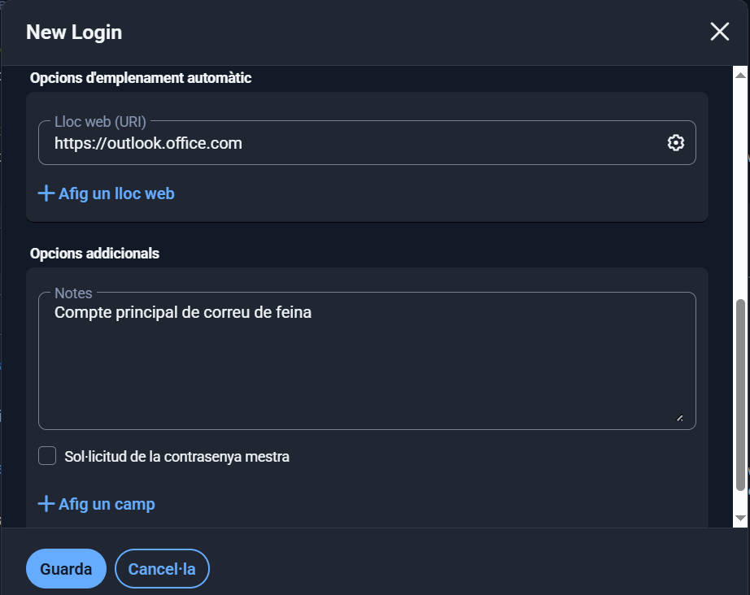
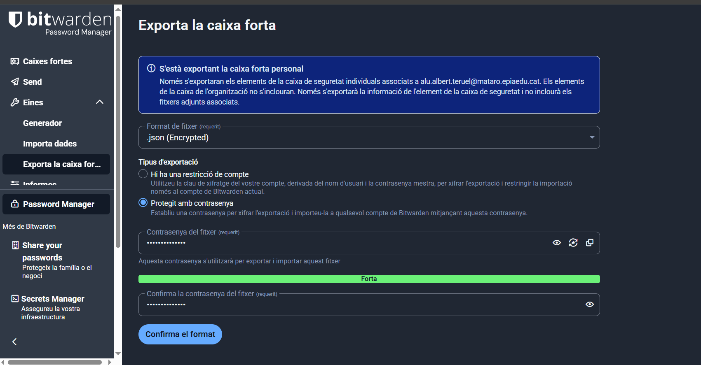
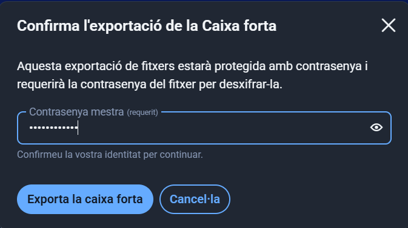

# Guia d'Ús de Bitwarden per a l'Equip Tècnic d'EverPia

Aquesta guia t'ajudarà a començar a utilitzar Bitwarden pas a pas. No et preocupis si és la primera vegada que uses un gestor de contrasenyes, segueix les instruccions i en pocs minuts estaràs protegint les teves credencials.

## 1. Instal·lació i Configuració Inicial

### Pas 1: Crear un compte a Bitwarden

1. Ves a la pàgina web oficial: **https://bitwarden.com**
2. Fes clic al botó **"Get Started"**
3. Omple el formulari:
   - **Correu electrònic**: Usa el teu email corporatiu d'EverPia
   - **Contrasenya mestra**: Aquesta és la contrasenya més important que crearàs!
  

**Important sobre la contrasenya mestra:**
- Ha de ser llarga (mínim 12-16 caràcters)
- Ha de combinar lletres majúscules, minúscules, números i símbols
- Ha de ser única i que no hagis utilitzat mai en cap altre lloc
- Exemple de bona contrasenya mestra: `Ev3rP!a-S3gur3t@t-2025` (No utilitzeu la contrasenya d'exemple)

4. Marca la casella d'acceptar els termes i fes clic a **"Create Account"**

### Pas 2: Descarregar i instal·lar l'aplicació d'escriptori

1. Un cop creat el compte, ves a **https://bitwarden.com/download/**
2. Descarrega l'aplicació per al teu sistema operatiu:
   - **Windows**: Descarrega l'instal·lador .exe
   
3. **Per a Windows:**
   - Executa l'arxiu descarregat `Bitwarden-Installer-X.X.X.exe`
   - Segueix l'assistent d'instal·lació
   - Fes clic a "Instal·lar" i espera que acabi

### Pas 3: Iniciar sessió a l'aplicació

1. Obre l'aplicació de Bitwarden
2. Introdueix el teu **correu electrònic**
3. Introdueix la teva **contrasenya mestra**
4. Fes clic a **"Log In"**

### Pas 4: Instal·lar l'extensió del navegador (Recomanat)

L'extensió del navegador et permetrà emplenar automàticament les contrasenyes mentre navegues.

**Per a Google Chrome:**
1. Ves a Chrome Web Store: **https://chrome.google.com/webstore**
2. Cerca "Bitwarden Password Manager"
3. Fes clic a **"Afegir a Chrome"**
4. Confirma fent clic a **"Afegir extensió"**
5. Apareixerà una icona de Bitwarden a la barra del navegador (dalt a la dreta)
6. Fes clic a la icona i inicia sessió amb les teves credencials

## 2. Generació de Contrasenyes Segures

Un dels punts forts de Bitwarden és que pot crear contrasenyes súper segures automàticament.

### Com generar una contrasenya nova

1. Obre l'aplicació de Bitwarden, l'extensió del navegador o la web
2. A la part superior, trobaràs diverses pestanyes. Fes clic a l'icona del **generador** 
3. Veuràs diverses opcions per personalitzar la contrasenya:

**Paràmetres del generador:**
- **Tipus**: Pots escollir entre contrasenya, frase de pas o nom d'usuari
- **Longitud**: Per defecte ve amb 14 caràcters, però per a comptes importants és millor usar 16-20 caràcters
- **Caràcters especials**: Marca aquesta opció per incloure símbols
- **Números**: Inclou dígits del 0 al 9
- **Majúscules**: Inclou lletres majúscules (A-Z)
- **Minúscules**: Inclou lletres minúscules (a-z)
- **Quantitat**: triar la quantitat que hi ha de cada símbol, majúscula, nombre, etc
- **Evita caràcters ambigus**: Activa aquesta opció per evitar caràcters que es poden confondre com 0 (zero) i O (lletra o)

4. Un cop configurats els paràmetres, fes clic al botó **"Generar"** o simplement copia la contrasenya que ja ha aparegut
5. La contrasenya es copiarà automàticament al porta-retalls i podràs enganxar-la on la necessitis

**Exemple de contrasenya generada:** `84*uO1h$%ve54f`

## 3. Exemples d'Ús i Emplenat Automàtic

### Com desar una credencial d'un compte de correu electrònic

Imagina que has de desar les credencials del teu correu corporatiu d'Outlook.

**Mètode 1: Des de l'aplicació d'escriptori o web**

1. Obre l'aplicació de Bitwarden
2. A la pestanya **"My Vault"** (La meva caixa forta), fes clic al botó **"+"** o **"Add Item"**
3. Omple els camps:
   - **Nom**: Posa un nom descriptiu, per exemple: "Correu corporatiu Outlook"
   - **Carpeta**: Pots deixar-ho a "No Folder" o crear una carpeta com "Treball" per organitzar-ho millor
   - **Nom d'usuari**: El teu email, per exemple: `nom.cognom@everpia.com`
   - **Contrasenya**: Aquí tens dues opcions:
     - Copiar la contrasenya actual (si ja en tens una)
     - Fer clic a la icona del generador (a la dreta del camp) per crear una nova contrasenya segura
   - **URI**: Posa l'adreça web on fas servir aquest compte, per exemple: `https://outlook.office.com`
   - **Notes**: Camp opcional per afegir informació addicional, com "Compte principal de correu de feina"
4. Fes clic a **"Save"** (Desar) a la part inferior

 

**Mètode 2: Des del navegador (auto-desar)**

1. Ves a la pàgina de login del servei (per exemple, https://outlook.office.com)
2. Introdueix el teu nom d'usuari i contrasenya manualment
3. Quan facis clic a "Iniciar sessió", Bitwarden detectarà que has introduït credencials noves
4. Apareixerà un missatge emergent a la part superior del navegador preguntant **"Vols desar aquest inici de sessió?"**
5. Fes clic a **"Si"** o **"Desar"**
6. Bitwarden desarà automàticament el nom d'usuari, contrasenya i l'adreça web

**Per a aplicacions d'escriptori (no web):**

Alguns programes d'escriptori també necessiten credencials. Encara que Bitwarden no pot emplenar automàticament en aplicacions natives, pots desar-les igualment:

1. Crea un nou element com abans
2. A **URI**, posa el nom de l'aplicació, per exemple: "Aplicació Steam"
3. Quan necessitis la contrasenya, obre Bitwarden, cerca l'element i copia manualment la contrasenya

### Com fer servir l'extensió del navegador per emplenar automàticament

L'emplenat automàtic és una de les funcions més útils de Bitwarden.

**Mètode automàtic:**

1. Ves a la pàgina web on vols iniciar sessió (per exemple, https://outlook.office.com)
2. Fes clic al camp del nom d'usuari o contrasenya
3. Apareixerà una petita icona de Bitwarden dins del camp o a la part superior del navegador amb un número (indicant quantes credencials tens desades per aquest lloc)
4. Fes clic a la icona de Bitwarden
5. Selecciona el compte que vols utilitzar de la llista
6. Bitwarden omplirà automàticament el nom d'usuari i la contrasenya

## 4. Gestió de Còpies de Seguretat (Backup)

### Com fer una còpia de seguretat

**Des de l'aplicació d'escriptori o web:**

1. Obre l'aplicació de Bitwarden
2. Fes clic al menú **"Arxius o eines"**
3. Selecciona **"Exporta la caixa forta"**
4. Es pot obrir una finestra o et redirigirà al navegador web (No s'obrirà si ho estàs fent des d'allà)
5. Tria el format d'exportació:
   - **Format recomanat**: `.json (Encrypted)` → Aquesta opció xifra les teves dades
   - Altres opcions: `.json` o `.csv` (però aquestes no estan xifrades, així que són menys segures)

6. Si tries `.json (Encrypted)`, veuràs dues opcions:
   - **Account restricted**: Només podràs importar aquesta còpia al mateix compte de Bitwarden
   - **Password protected** (RECOMANAT): Podràs protegir l'exportació amb una contrasenya diferent

7. Si tries **Password protected**:
   - Introdueix una contrasenya forta per protegir l'arxiu
   - Confirma la contrasenya
   - **Important:** Aquesta contrasenya pot ser diferent de la teva contrasenya mestra, però ha de ser igualment segura. Apunta-la en un lloc segur.

8. Introdueix la teva **contrasenya mestra** de Bitwarden per confirmar l'exportació

9. Fes clic a **"Export Vault"**
10. Es descarregarà un arxiu amb nom similar a: `bitwarden_encrypted_export_20251021.json`

### On i com guardar la còpia de seguretat de forma segura

Ara que tens l'arxiu de backup, és crucial guardar-lo en un lloc segur.

**Opció 1: Memòria USB xifrada (MOLT RECOMANAT)**

1. **Compra o utilitza una memòria USB** dedicada només per a còpies de seguretat
2. **Xifra la memòria USB** abans de guardar-hi res:
   
   **A Windows (amb BitLocker):**
   - Connecta la memòria USB
   - Fes clic dret sobre la unitat al "Aquest equip"
   - Selecciona "Activa BitLocker"
   - Tria "Utilitzar una contrasenya per desbloquejar la unitat"
   - Introdueix una contrasenya forta
   - Guarda la clau de recuperació en un lloc segur
   - Completa el procés de xifratge

3. **Copia l'arxiu de backup** a la memòria USB xifrada
4. **Guarda la memòria USB** en un lloc físicament segur:
   - Calaix tancat amb clau
   - Caixa forta petita a casa o al despatx
   - Mai la deixis a la vista o en un lloc accessible per altres persones

**Opció 2: Emmagatzematge al núvol xifrat**

Si prefereixes tenir el backup al núvol (per poder accedir-hi des de diferents llocs), assegura't que estigui ben protegit:

1. **Usa un servei de núvol xifrat end-to-end** com:
   - **Nextcloud** 
   - **Tresorit**
   - **Sync.com**
   - **ProtonDrive**

2. **Evita serveis no xifrats** com Dropbox, Google Drive o OneDrive per a l'arxiu sense xifrar addicional

**Per a EverPia**

1. **Còpia original**: Les contrasenyes a Bitwarden (núvol)
2. **Primera còpia de seguretat**: Memòria USB xifrada guardada a la caixa forta de l'oficina
3. **Segona còpia de seguretat**: Arxiu xifrat addicional amb VeraCrypt/7-Zip pujat al núvol o a casa en una ubicació segura

**Freqüència de les còpies:**

- Fes una còpia de seguretat **cada mes** o **després d'afegir credencials importants**
- Programa un recordatori al calendari per no oblidar-te

**Prova de recuperació:**

- Cada 3-6 mesos, **prova de restaurar** la còpia de seguretat per assegurar-te que funciona
- Així et assegures que les contrasenyes dels arxius xifrats són correctes i que pots recuperar les dades si calgués

