# Guia d'Instal·lació del Servidor LDAP amb Ubuntu

## Introducció

En aquesta guia vamos a aprendre com instal·lar i configurar un servidor LDAP (OpenLDAP) en una màquina virtual Ubuntu Server. Aquest servidor es va a encarregar de guardar i gestionar tots els usuaris i grups de la nostra xarxa de prova.

---

## Part 1: Preparació de l'Infraestructura

Abans de començar, necessitem verificar que la màquina virtual està ben configurada.

### Pas 1: Configurar el Nom del Servidor

El domini del servidor ha de ser `server.innovatech22.test`.

Per comprovar-lo:
```bash
hostname -f
```


### Pas 2: Verificar les Interfaces de Xarxa

Necessitem dues connexions de xarxa:

1. **Interfície NAT**: Per accedir a Internet i descarregar paquets
2. **Interfície Host-Only**: Per comunicar-se amb el client privat

---

## Part 2: Instal·lació d'OpenLDAP

### Pas 3: Actualitzar el Sistema

Primer, actualitzem els paquets del sistema:
```bash
sudo apt update
sudo apt upgrade
```

### Pas 4: Instal·lar OpenLDAP

Executem la comanda d'instal·lació:
```bash
sudo apt install slapd ldap-utils
```

Durant l'instal·lació, et demanarà una contrasenya d'administrador.

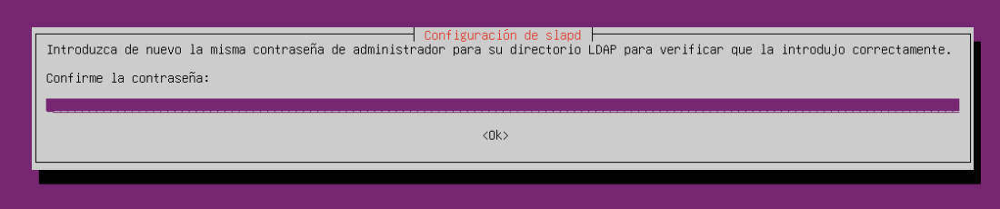

### Pas 5: Validar la Instal·lació

Per verificar que OpenLDAP s'ha instal·lat correctament, executem:
```bash
sudo slapcat
```

Aquesta comanda mostrarà la base de dades de LDAP actual.

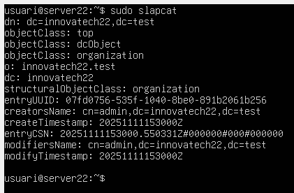

---

## Part 3: Configuració Bàsica d'OpenLDAP

### Pas 6: Configurar el Domini

El domini de la nostra xarxa de prova ha de ser `innovatech22.test`. Aquesta configuració es va a fer automàticament durant la instal·lació.

Per comprovar-la:
```bash
sudo ldapsearch -x -b "dc=innovatech22,dc=test"
```

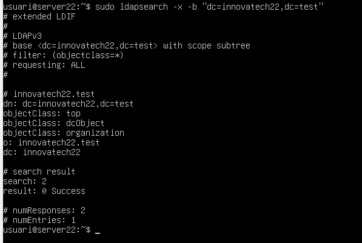

### Pas 7: Crear les Unitats Organitzatives (OU)

Ara creem els carpetes del directori per guardar usuaris i grups. Creem un fitxer anomenat `ou.ldif`:

```bash
nano ou.ldif
```

Dins del fitxer, escriu el següent:
```
dn: ou=users,dc=innovatech22,dc=test
objectClass: organizationalUnit
objectClass: top
ou: users

dn: ou=groups,dc=innovatech22,dc=test
objectClass: organizationalUnit
objectClass: top
ou: groups
```

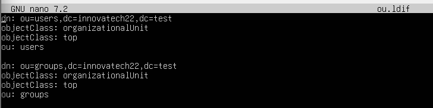

Desa el fitxer amb `Ctrl+X`, después `Y` i `Enter`.

### Pas 8: Afegir les OUs al Directori

Executem la comanda per afegir les unitats que vam crear:
```bash
sudo ldapadd -x -D "cn=admin,dc=innovatech22,dc=test" -W -f ou.ldif
```

Et demanarà la contrasenya.

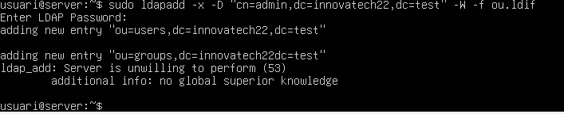

### Pas 9: Verificar les OUs Creades

Per comprovar que les unitats organitzatives s'han creat correctament:
```bash
ldapsearch -xLLL -b "dc=innovatech22,dc=test"
```

---

## Part 4: Instal·lació de LAM (Gestor d'Usuaris LDAP)

LAM és una eina web que facilita la gestió d'usuaris i grups sense haver de fer comandes.

### Pas 10: Instal·lar LAM

```bash
sudo apt install ldap-account-manager
```


### Pas 11: Accedir a LAM des de l'Ordinador Principal

Obres el navegador web de l'ordinador principal i vas a:
```
http://192.168.56.101/lam
```

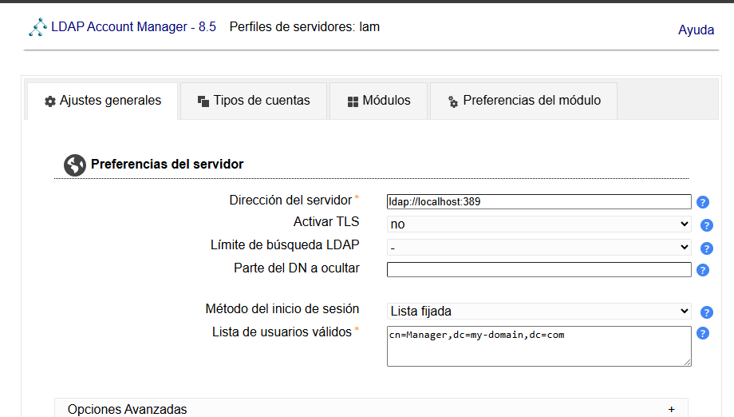

### Pas 12: Configurar LAM per Defecte

Dins de LAM, configura els paràmetres per defecte perquè:
cn=admin,dc=innovatech,dc=test

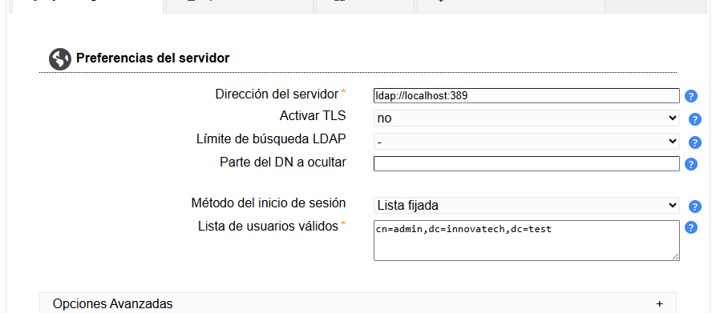

---

## Part 5: Creació de Grups i Usuaris

### Pas 13: Crear els grups

Dins de LAM, creem dos grups:
1. **tech**: Un grup per als tècnics
2. **manager**: Un grup per als gestors

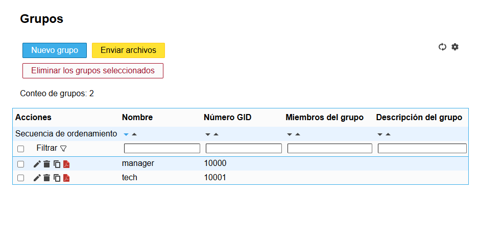

### Pas 14: Crear els usuaris

Creem dos usuaris:
1. **tech01**: Pertany al grup `tech`
2. **manager01**: Pertany al grup `manager`

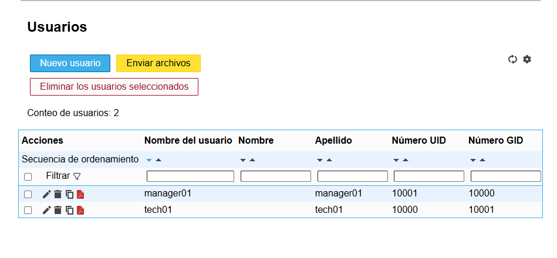

---

## Part 6: Configuració del Client Ubuntu Desktop

Ara configurem una màquina client que es connectarà al servidor LDAP.

### Pas 15: Instal·lar Ubuntu Desktop al Client

Instal·la una nova màquina virtual amb Ubuntu Desktop. Assegura't que la interfície de xarxa es connecta a la mateixa xarxa Host-Only que el servidor.

### Pas 16: Configurar la Resolució de Noms

Dins de la màquina client, obrim l'arxiu d'hosts:
```bash
sudo nano /etc/hosts
```

Afegim aquesta línia:
```
192.168.56.101    server.innovatech22.test
```


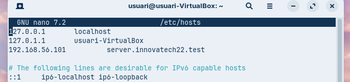


### Pas 17: Verificar la Connectivitat amb el Servidor

Instal·lem el paquet ldap-utils

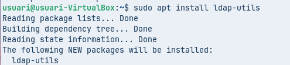

Executem una comanda des del client per verificar que es pot connectar al servidor LDAP:
```bash
ldapsearch -x -H ldap://server.innovatech22.test -b "dc=innovatech22,dc=test"
```

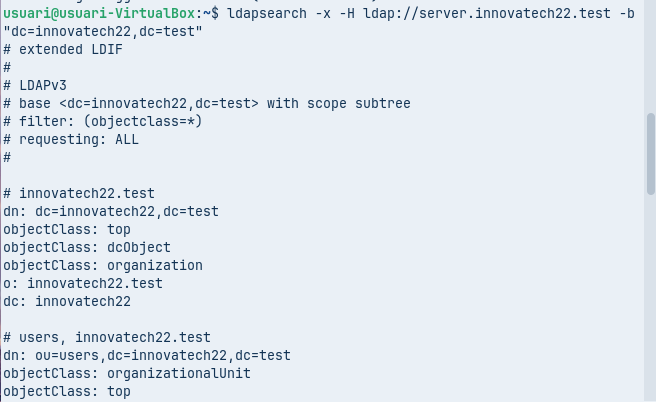

### Pas 18: Instal·lar els Mòduls d'Autenticació

Instal·lem els paquets necessaris per permetre que els usuaris del LDAP es puguin connectar localment:
```bash
sudo apt install libnss-ldap libpam-ldap nscd
```
Configuracio:

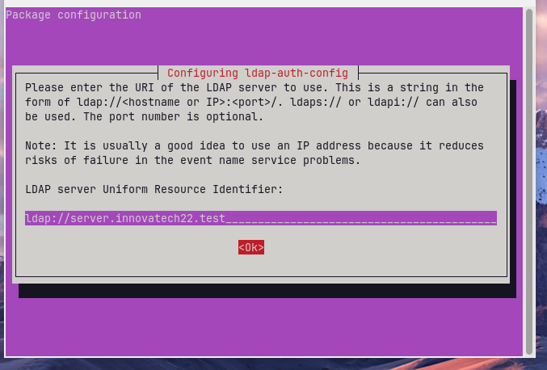
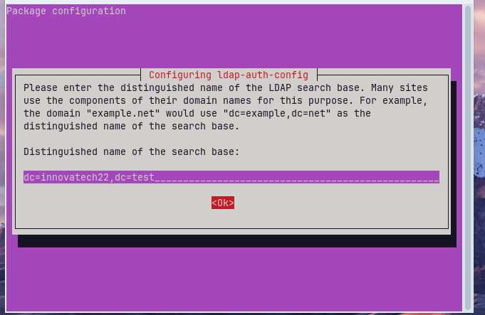

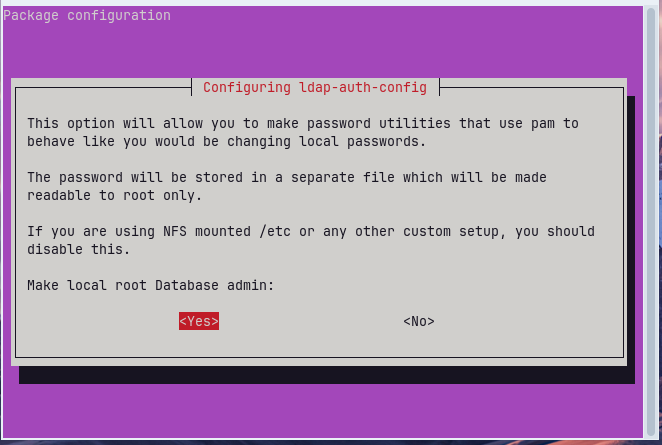
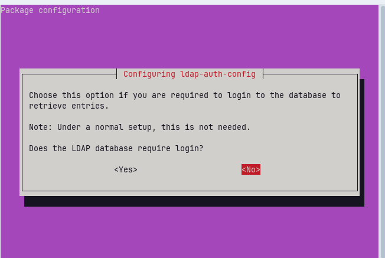
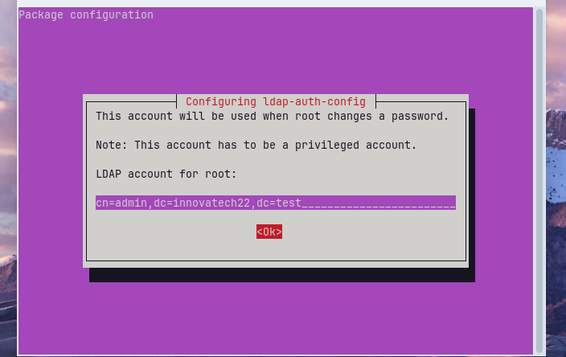
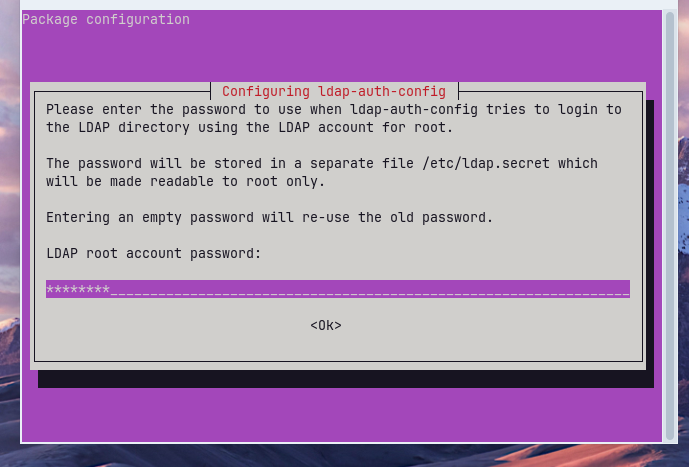

Verificació:

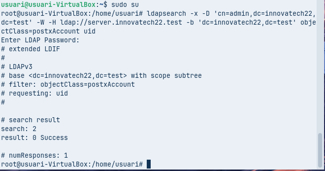

### Pas 19: Configurar la Autenticació LDAP

Modifiquem l'arxiu `/etc/nsswitch.conf` per afegir LDAP a la consulta d'usuaris:

```bash
sudo nano /etc/nsswitch.conf
```

Busca les línies que digan `passwd:`, `group:` i `shadow:` i afegeix `ldap` al final:

```
passwd:         files systemd ldap
group:          files systemd ldap
shadow:         files ldap
```

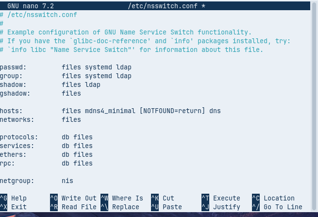

### Pas 20: Configuracions

Modifiquem el fitxer `/etc/pam.d/common-password`:

```bash
sudo nano /etc/pam.d/common-password
```

Elimineu aquesta part d'una línia:
```
use_authtok
```

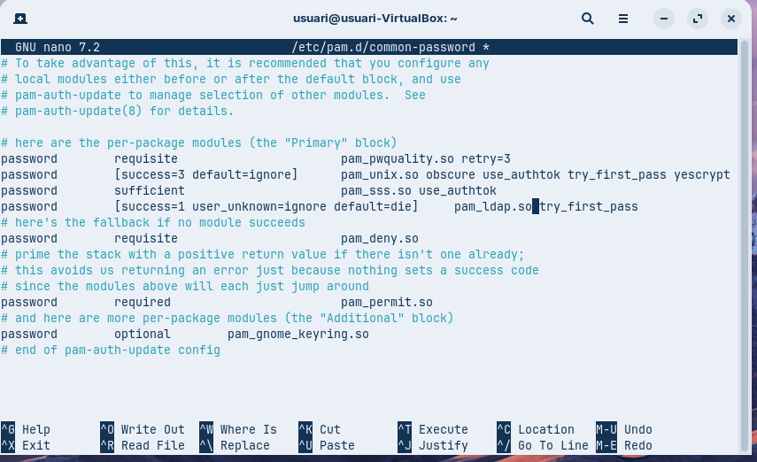

Ara editem l’arxiu /etc/pam.d/common-session i afegim la línia:

```
session optional       pam_mkhomedir.so skel=/etc/skel umask=077
```

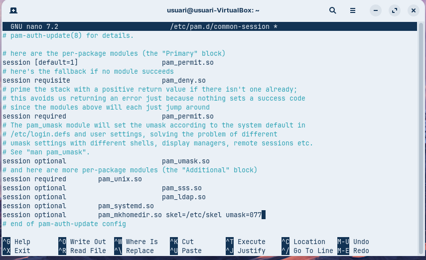


### Pas 21: Verificar que els Usuaris Són Visibles

Reinicia els serveis:
```bash
sudo systemctl restart nscd
```


Després verifica que els usuaris del LDAP són visibles:
```bash
getent passwd | tail
```

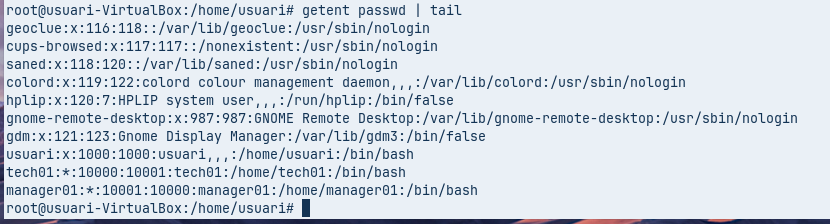

### Pas 22: Prova d'Accés Final

Reinicia la màquina client

Quan es reinicia, intenta connectar-te amb l'usuari `tech01` i la contrasenya que vam configurar. Si tot està bé, l'usuari hauria de poder connectar-se i crear automàticament la carpeta personal.


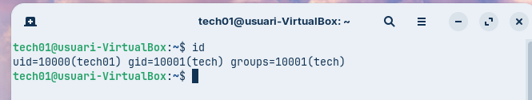


---

