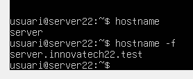

# Guia d'Instal·lació del Servidor LDAP amb Ubuntu

---

## Part 1: Preparació de l'Infraestructura

Abans de començar, necessitem verificar que la màquina virtual està ben configurada.

### Pas 1: Configurar el Nom del Servidor

El domini del servidor ha de ser `server.innovatech22.test`.

Per comprovar-lo:
```bash
hostname -f
```



### Pas 2: Verificar les Interfaces de Xarxa

Necessitem dues connexions de xarxa:

1. **Interfície NAT**: Per accedir a Internet i descarregar paquets
2. **Interfície Host-Only**: Per comunicar-se amb el client privat

---
