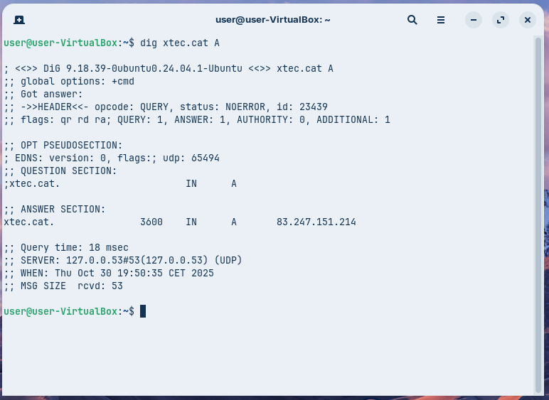
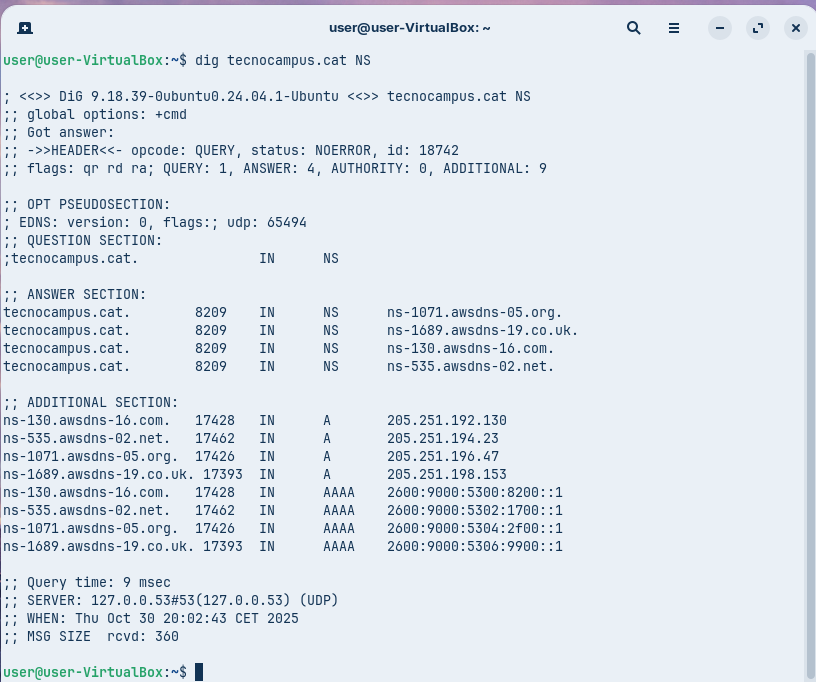
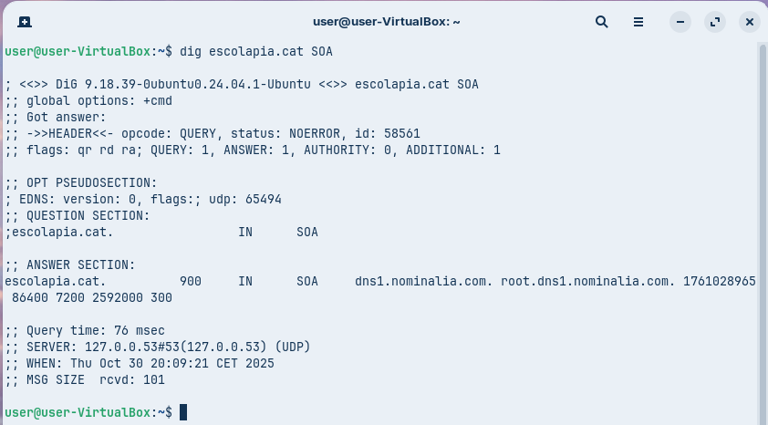
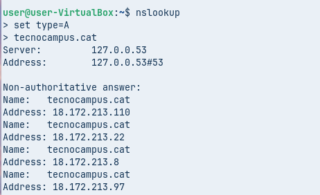
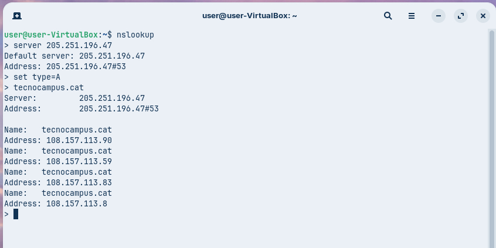
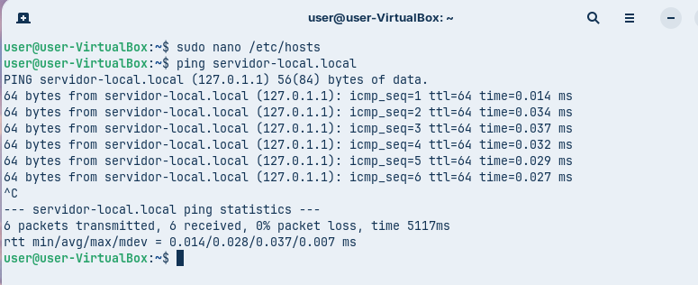
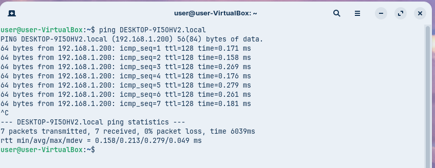

# Fase Pràctica: Diagnosi de Noms (Auditoria amb CLI)

## A. Diagnosi Avançada amb dig (Linux / macOS)

### Comanda 1: Consulta Bàsica de Registre A

**Comanda executada:**
```
dig xtec.cat A
```



**Anàlisi:**
- **IP de resposta:** 83.247.151.214
- **Valor TTL:** 3600 segundos
- **Servidor que ha respost:** 127.0.0.53

---

### Comanda 2: Consulta de Servidors de Noms (NS)

**Comanda executada:**
```
dig tecnocampus.cat NS
```



**Anàlisi:**
- **Servidors de noms autoritatius:**
  - ns-1071.awsdns-05.org
  - ns-1689.awsdns-19.co.uk
  - ns-130.awsdns-16.com
  - ns-535.awsdns-02.net

---

### Comanda 3: Consulta Detallada SOA

**Comanda executada:**
```
dig escolapia.cat SOA
```



**Anàlisi:**
- **Email de l'administrador:** root.dns1.nominalia.com
- **Número de sèrie del domini:** 1761028965
- **Altres dades SOA importants:** 
  - Refresh: 86400
  - Retry: 7200
  - Expire: 2592000
  - Minimum TTL: 300

---

### Comanda 4: Consulta de Resolució Inversa

**Comanda executada:**
```
dig -x 147.83.2.135
```


**Anàlisi:**
- **Informació obtinguda:**
  - upc.cat
  - masters.upc.edu
  - edicioweb.produccio.upc.edu
  - upc.edu
  - www.upc.es
  - barcelonatech-upc.eu
  - barcelonatech.upc.edu
  - saladepremsa.upc.edu
  
- **Tipus de registre:** PTR

---

## B. Comprovació de Resolució amb nslookup (Multiplataforma)

### Comanda 1: Consulta Bàsica no Autoritativa

**Comandes executades en mode interactiu:**
```
nslookup
> set type=A
> tecnocampus.cat
```



**Anàlisi:**
- **Per què la resposta és no autoritativa?**
  - La resposta és no autoritativa perquè prové d’un resolver intermediari (una memòria cau DNS) i no directament del servidor autoritatiu del domini.
  - El servidor que respon no és el servidor oficial responsable de tecnocampus.cat

---

### Comanda 2: Consultes Autoritatives

**Comandes executades en mode interactiu:**
```
> server 205.251.196.47
> set type=A
> tecnocampus.cat
```



**Anàlisi:**
- **Diferències respecte a la comanda 1:**
  - Ara la resposta és autoritativa, ja que prové directament del servidor DNS 205.251.196.47, que és un servidor autoritatiu per al domini.
  - La informació no prové d’un resolver intermediari sinó del servidor oficial del domini tecnocampus.cat.
  - Les adreces IP retornades són diferents (ara comencen per 108.157.113.*).
  - També canvia el servidor que respon (abans era 127.0.0.53, ara és 205.251.196.47).

---

## C. Resolucions Locals

### Prova 1: Resolució via /etc/hosts

**Pasos realitzats:**
1. Editar el fitxer `/etc/hosts`
2. Afegir una entrada local:
```
127.0.1.1  servidor-local.local
```
3. Comprovar que es resol correctament:
```
ping servidor-local.local
```



**Anàlisi:**
- La resolució funciona sense necessitat de servidor DNS
- El sistema consulta primer el fitxer hosts abans de fer consultes DNS

---

### Prova 2: Resolució via mDNS

**Comanda executada:**
```
ping nom-equip.local
```



**Anàlisi:**
- mDNS permet resoldre noms locals sense DNS central
- Els equips a la xarxa local responen als noms acabats en `.local`
- Útil per entorns de xarxa local sense servidor DNS propi

---

## Conclusions de la Fase Pràctica

1. **dig és una eina poderosa** per a consultes detallades de DNS, mostrant informació completa i autoritativa
2. **nslookup permet interactivitat** i facilita consultes múltiples al mateix servidor
3. **Les respostes autoritatives vs. no autoritatives** són importants per entendre on es gestiona realment el domini
4. **La resolució local** (hosts i mDNS) és essencial per a entorns sense DNS centralitzat
5. **El TTL controla l'actualització** dels resultats en cache
